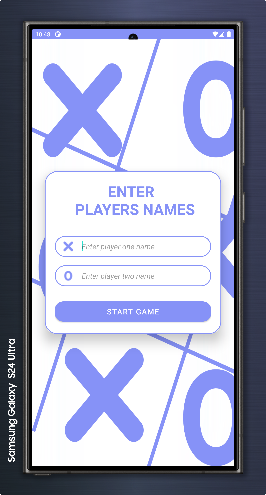
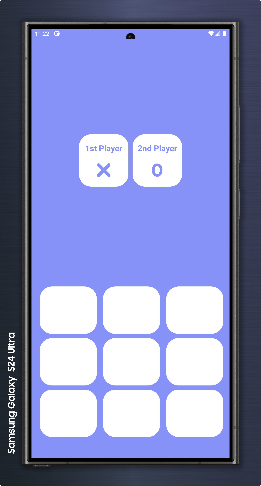
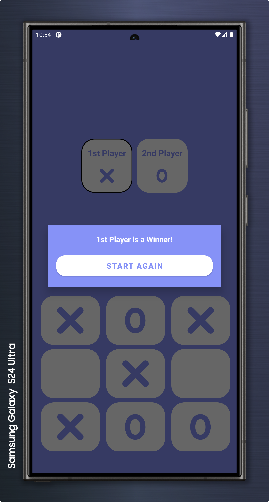
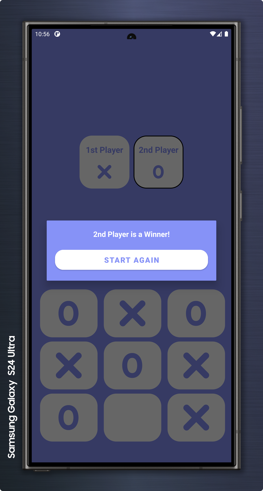

# Tic-Tac-Toe Game App

## Project overview

This project demonstrates how to create a classic Tic-Tac-Toe game using Android Studio and Java. The app allows two players to compete against each other by taking turns on a 3x3 grid. The first player to align three of their symbols (either X or O) horizontally, vertically, or diagonally wins the game.

## Features

- **Player Names Input**: The game starts with a screen where players can enter their names. This adds a personalized touch to the game.
- **Dynamic Gameplay**: The game board updates in real-time according to the players' turns. The player's turn is highlighted, making it easy to follow the action.
- **Winning Notification**: At the end of each game, a dialog box appears to announce the winner, showing the name of the player who won.
- **Play Again Option**: After a game is over, players can choose to start a new game with the "Start Again" button.

## Design

- **Color Scheme**: The app features a soothing Lavender color scheme with the HEX code #8692f7, providing a visually appealing user experience.

## Screenshots

Here are some screenshots of the app in action:

### Home Page - Player Names Input

### Game Page - Players Competing

### Player 1 Wins

### Player 2 Wins

